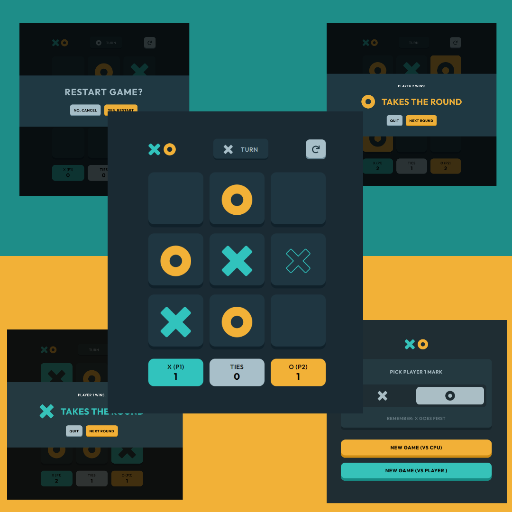

# Frontend Mentor - Tic Tac Toe solution

This is a solution to the [Tic Tac Toe challenge on Frontend Mentor](https://www.frontendmentor.io/challenges/tic-tac-toe-game-Re7ZF_E2v). Frontend Mentor challenges help you improve your coding skills by building realistic projects. 

## Table of contents

- [Overview](#overview)
  - [The challenge](#the-challenge)
  - [Links](#links)
- [My process](#my-process)
  - [Built with](#built-with)
  - [What I learned](#what-i-learned)
  - [Continued development](#continued-development)
  - [Useful resources](#useful-resources)
- [Author](#author)
- [Acknowledgments](#acknowledgments)

## Overview

### The challenge

Users should be able to:

- View the optimal layout for the game depending on their device's screen size
- See hover states for all interactive elements on the page
- Play the game either solo vs the computer or multiplayer against another person
- **Bonus 1**: Save the game state in the browser so that it’s preserved if the player refreshes their browser
- **Bonus 2**: Instead of having the computer randomly make their moves, try making it clever so it’s proactive in blocking your moves and trying to win


### Links

- Solution URL: [Github Repo](https://github.com/kebin20/tic-tac-toe-react)
- Live Site URL: [Tic Tac Toe](https://monumental-blini-81fbb9.netlify.app/)

## My process

### Built with

- Semantic HTML5 markup
- CSS custom properties
- Flexbox
- CSS Grid
- [Vite](https://vitejs.dev/) - Build Tool
- [React](https://reactjs.org/) - JS library


### What I learned

Building this app also was excellent practice in creating conditional logic, where it's extensive use was mostly in deciding which player was "X" or "O" and displaying the appropriate components that reflect the change in player turns or wins. An example would be in my PvPWinnerModal: 

```jsx
function PvPWinnerModal(props) {
  return (
    <div className="backdrop">
      <div className="winner-modal">
        <p className="show-winner-message">
          {props.winner === 'X' && props.playerOne === 'X'
            ? 'Player 1 Wins!'
            : props.winner === 'O' && props.playerOne === 'O'
            ? 'Player 1 Wins!'
            : props.winner === 'X' && props.playerTwo === 'X'
            ? 'Player 2 Wins!'
            : props.winner === 'O' && props.playerTwo === 'O'
            ? 'Player 2 Wins!'
            : props.winner === null && !props.board.includes(null)
            ? ''
            : ''}
        </p>
        <div className="show-winner-icon-container">
          {props.winner === 'X' ? (
            
          ) : props.winner === 'O' ? (
            
          ) : props.winner === null && !props.board.includes(null) ? (
            ''
          ) : (
            {}
          )}
          {props.winner === null && !props.board.includes(null) ? (
            <p className="tied-message">round tied</p>
          ) : (
            <p
              className={
                props.winner === 'X'
                  ? 'winner-x-icon-message'
                  : 'winner-o-icon-message'
              }
            >
              takes the round
            </p>
          )}
        </div>
```


Also, thanks to the tutorial from Scrimba in creating a simple Tic Tac Toe app with React, it helped me understand the logic behind how the game is played and how the winner is calculated, when the next player is decided. This piece of code helped me understand the logic on how the game is played and it uses a helper component that calculates the winner of the game: 

```jsx
  const [board, setBoard] = useState(Array(9).fill(null));

  const { winner, winningCombination } = calculateWinner(board);

  function handleClick(i) {
    const boardCopy = [...board];
    // If user click a filled in square or if game is won, return
    if (winner || boardCopy[i]) return;
    // Insert an O or an X into the square depending on the player
    let value = 'O';
    if (xIsNext) {
      if (props.playerOne === 'X' || props.playerTwo === 'X') {
        value = 'X';
      } else if (props.playerOne === 'O' || props.playerTwo === 'O') {
        value = 'O';
      }
    }

    boardCopy[i] = value;
    setBoard(boardCopy);
    setXisNext(!xIsNext);
  }
```

I had an interesting issue where the calculateWinner function didn't work due to an issue where the calculateWinner function were expecting the squares array to contain string ("X" or "O") and in my handleClick function, I was inserting React elements ( tags) into the boardCopy array instead which of course didn't work. 

The solution for this was to include a conditional logic within the square component where if the value of the square equals to the string "X", then render the Img element that contains the image of the X and vice versa for the O image. Otherwise, just return null. 

```jsx
  return (
    <button
      className={value && !winningCombination ? 'square'  : squareClass}
      onClick={value ? null : onClick}
    >
      {winner && winningCombination.includes(index) ? (
        value === 'X' ? (
          
        ) : (
          
        )
      ) : value === 'X' ? (
        
      ) : value === 'O' ? (
        
      ) : null}
    </button>
  );
```

### Continued development

I think with this project, I should be able to refactor code start using useContext in order to reduce some of the repetition that is occuring in the code. I may come back to this project and further refactor it if I learn other useful React hooks that will help make my code more efficient and readable. 

I also want to try out styled components to see if it would be more efficient for styling.

### Useful resources

- [Scrimba](https://scrimba.com/learn/reactgame) - This tutorial by Thomas Weibenfalk via Scrimba, helped me in making the core gameplay of Tic Tac Toe.

- [Stack Overflow - img paths](https://stackoverflow.com/questions/37644265/correct-path-for-img-on-react-js) - This helped me for linking to images within my project folder. Instead of linking normally to the path of my image, I have to first import it to be able to utilise it.

- [Bobby Hadz - centering a div in react](https://bobbyhadz.com/blog/react-center-div) - I wanted to center my whole game container horizontally and vertically on the page and this article helped me in doing that.

- [Upmostly](https://upmostly.com/tutorials/how-to-refresh-a-page-or-component-in-react) - This article helped me to find out a way to refresh the page on the click of a button.

- [Sebhastian](https://sebhastian.com/react-disable-button/) - I wanted to know how to disable buttons in react and this article helped in how to disable them, as well as showing how to conditionally disable them. 


## Author

- Frontend Mentor - [@kebin20](https://www.frontendmentor.io/profile/yourusername)

## Acknowledgments

Thank you to my friend Peter who helped me point out the problems within my Player vs CPU logic! 


